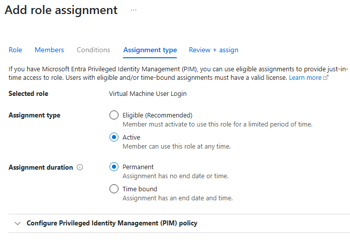

# AZURE Virtual Desktop (AVD) round 2

## Workspace

    - Alright! What we need now is a Workspace. (A virtual desktop workspace is a logical grouping of application groups, allowing users to access the desktops and applications published)
        

    - We add the application group :
        

    - No advance nor tags

    - And Voilà, Workspace created.

## Acces to users and admins

    - Now, need to give acces to the right people. So going back to the ressource group, let's go to acces control (IAM) and click add role assignment :
        

    - Then assign the right group. In this case, I created a Test group :
        

    - The assignment type is Active and permanent because I want this group to access the desktop at anytime :
        

    - Then I'll assign the admin group :
        

        - Note : **Since this setup has PIM activated, I used the eligible option.** (But it doesn't seem to work)
        