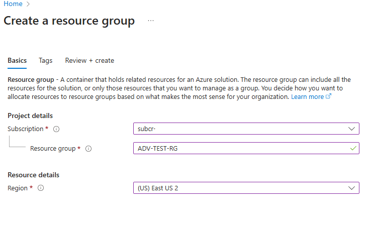
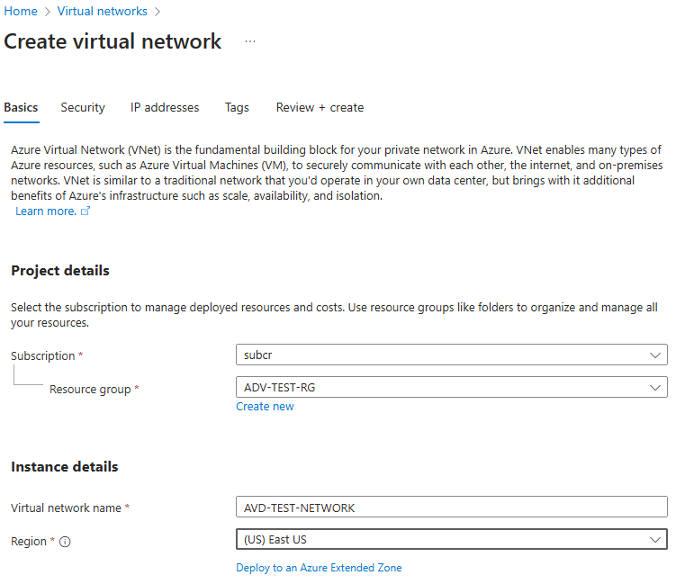
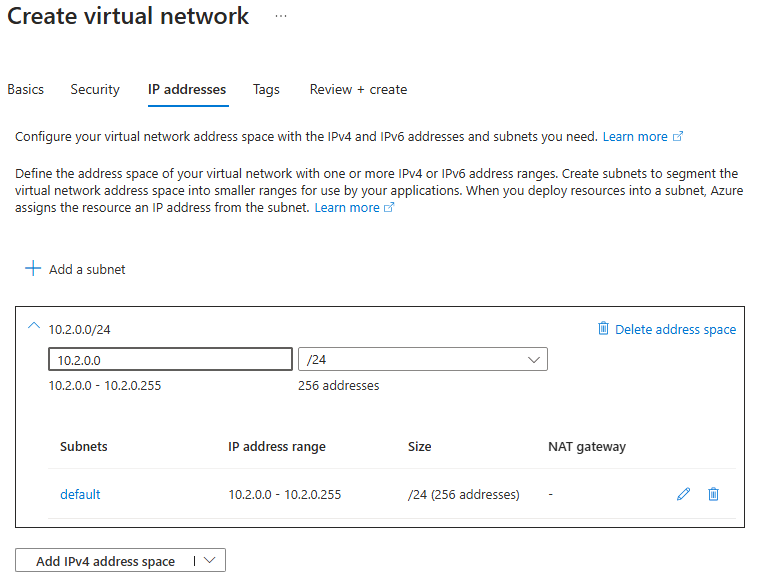
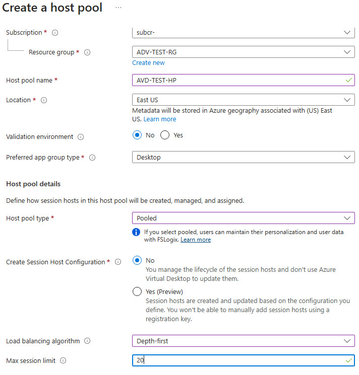
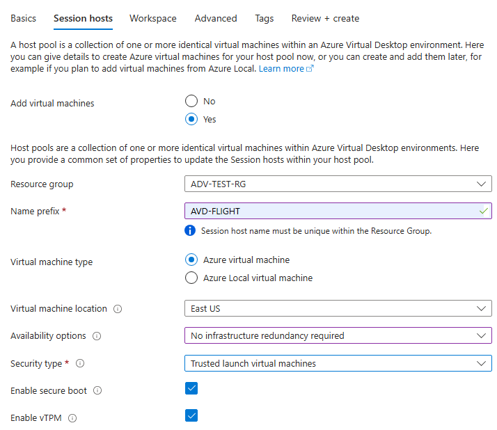
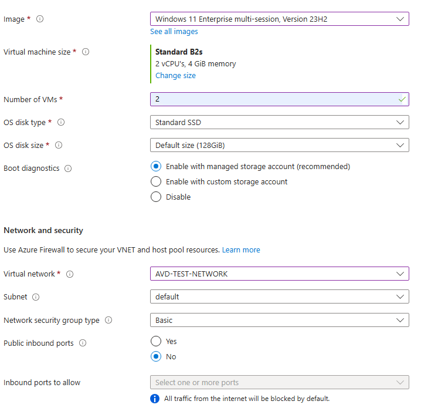
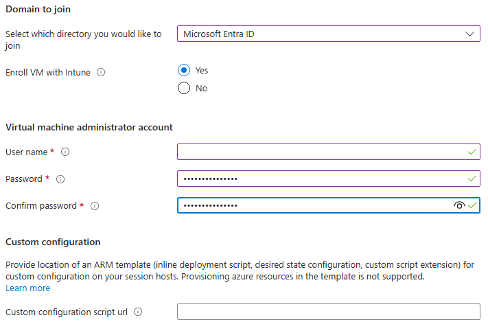

# AZURE Virtual Desktop (AVD)

    - Here's a new problem / chalenge : Users accessing sercured documentation remotely. 
        - A couple of things to analyze, do they need to acces the documentation localy or remotely or both?
        - What can they do with the documentation? Can they copy it or nned to use it with other apps?
        - Remote desktop in to a local server / machine would have been the way but it might create security issues and network access problems.
    
    - The goal : Create a Azure virtual desktop that will allow the functionnality of several applications at the same time.

    - Hypothese : Using Azure and it's ressources, I'll create desktop that will be redundant and available for users. Need to run 4 apps at the same time for maybe... and up to 90 users. So, what I'm thinking is going with 2 AVD.

## Things to do

    - First of, need to create a ressource group RG for this project or pick one if already created. (RG is a logical container that holds resources for a Azure solution - project)
        
    
    - Then, if not created, need to create a virtual network (for the ressources to communicate between themselves)
        - I'm using the default values except for the IP addresses (I don't need that many for a small deployment)

            

            
    
    - Next, need to go to Azure virtual Desktop and create a host pool :
        - As per options, I'm using this :
            
        
        - Session Hosts, I'm naming it AVD-FLIGHT (So then, the desktop will be AVD-FLIGHT1 and 2 for the next...)
            - I'm leaving pretty much all options as default :
                

            - Don't need to open public ports because the RDP session will be handle internaly...ish.
                

            - Domain is Entra in this case and need to create a admin account (cannot be administrator)
                
                - Do not have a custom script...

    - No Workspace, advanced or tags for now.

    - Now.... we wait.