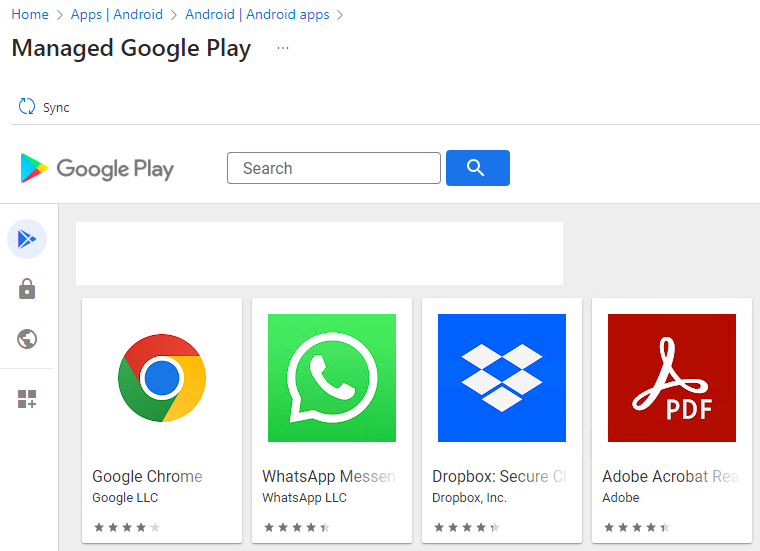
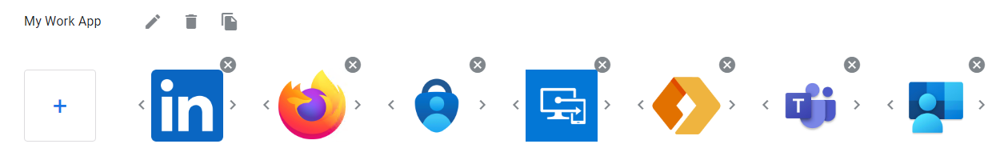
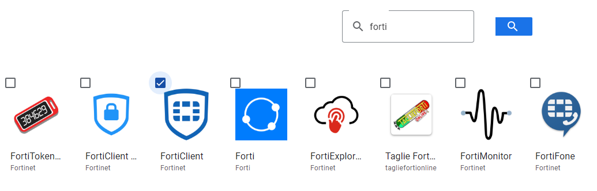
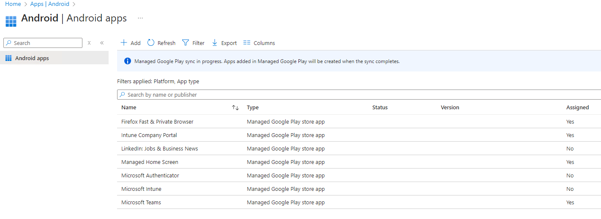
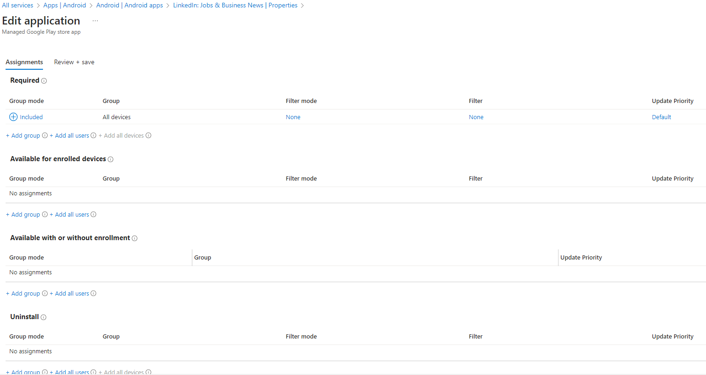

# How to Add an Android app in Intune

This example uses the managed Google Play store app to push applications to the corporate devices.
To access this fonctionnality, we need to go to Apps | Android

Then click 
    - This will bring you to the Select app type
        - You'll want to select the managed Google Play app

Once selected, the managed Google Play enterprise store will show:

Next, you'll need to select Organize the applications and it will bring you to this :

    -Click the plus sign 
    -Write the name of the app that you are looking for and click on the lens 
    -Select the app(s) wanted and then click on the add the application button
    -Then, click on save (buttom right of the screen) and validate
    -Last but not least, click on the sync button 

## After a few minutes to let Intune sync with the Google Play store

You should be back to this page with your new apps showing, in this case, Linkedin

Notice that the app was not assigned automaticaly, we have to do that. Click on the app - Properties and Edit on the Assignments link

    -In this case, I have selected all devices but groups or users can also but assigned.

And after a few minutes, the app will be installed