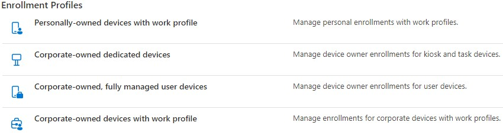

# How to Add an Android device in Intune

For what I figured out, there is a few approches/profiles to enrollment. 
    - Questions to be answered prior to :
            - What is allowed? Personal or corporate owned phones or both?
            - There is 4 different options :

            - For this scenario, the *corporate-owned dedicated devices* option is not required (yet?)
            - Start the series of tests, the third option will be used *Corporate-owned, fully managed user devices*

### Assuming that the managed Google Play account is already setup... 

We need to create a profile under Device | Enrollment and choose *Corporate-owned, fully managed user devices* and name it something logical or that your organization will understand.
    - For the Token type, choose Corporate-Owned with work profile (default) (At least that's what I took)

    - After and once completed, go back in the profile and acces the token :

### On a factory-reset device

    - NOw on the device that has been factory-reseted :
        - Choose your language
        - Connect to a wireless network
        - Accept the Google terms
        - When arriving at the Google sign in screen, enter afw#setup instead of a gmail account. 
            - It's the DPC identifier for Intune
        - Choose install for the Android Device policy app
            - For the Google services, I decided to not to select the options
            - Press  ACCEPT
        - Once on the enroll this device screen, scan the Token
            - Then it asks to log in with a Domain User
                - In theory, then it should install the apps that are configured in Intune
                    - And also, I registed the device in Intune (Option was given)

After a few minutes, the device shows up in Intune and can be managed.

