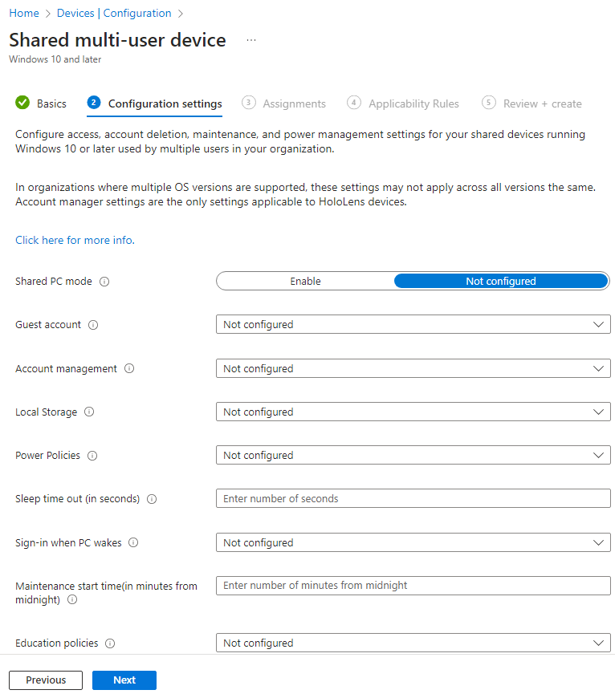
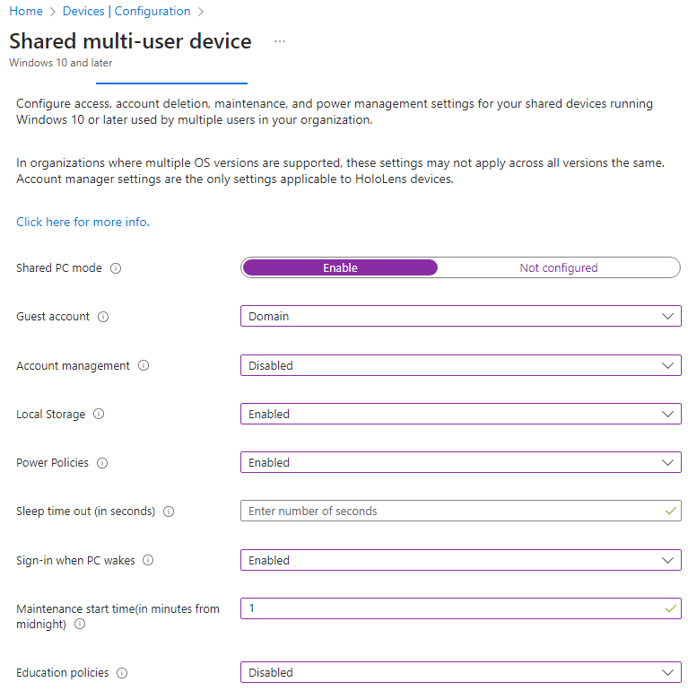
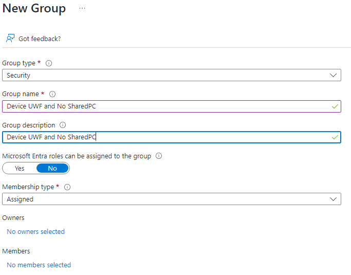
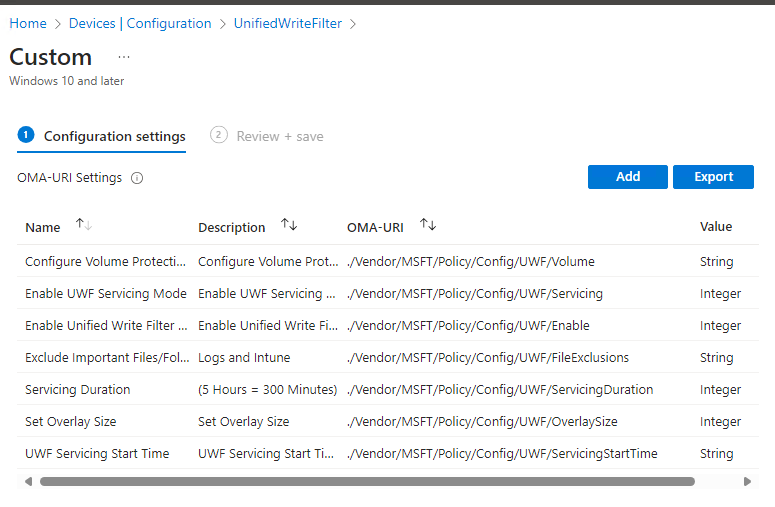
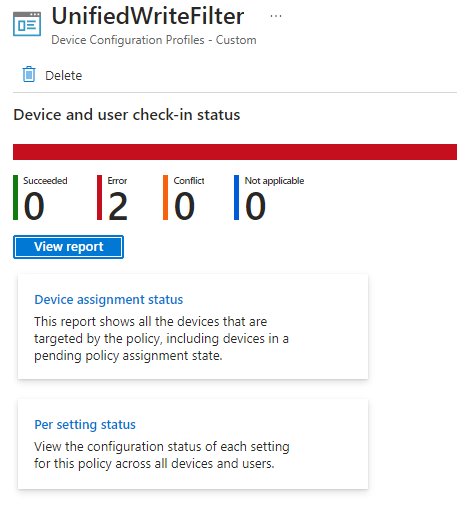

# Basic Shared Pc configuration in Intune (Part 1)

Fact : The current situation is that all PCs used by multiple users have a software called DeepFreeze. This software allows for the redirection of everything writen to the local drive (app installations, settings changes, saved data) to a virtual overlay. This overlay is temporary and it is cleared when a reboot is initiated. A maintenance schedule is between 0001 and 0600 everyday. This allows to run Windows update and other update if planned and pushed to the devices in question. (Not automaticaly)

Problem : This software is hosted localy and seems to have intermittent issues. Also, the additional complaints are : problems updating applications via Intune (no schedule), the server freezes often and problems going back in hibernation while Windows update is in the works.

Hypothese : To find a new solution with the tools that are given, the approach will be to utilize Intune, right click tools and Windows 10/11 features as an alternative to Deepfreeze.

# Plan :

##   Policy in Intune
        - The Shared Pc policy in Intune allows for a few configurations

            

        - First option is to enable Shared PC mode
        - Second, you can use a guess, a domain account or a combination of both. For this configuration, domain only.
        - Third, Account management allows the deletion of accounts at sign-off time and during system maintenance time periods. And this scenario, it will not be configured.
        - Fourth, Local storage. With local storage, users can save and view files on the device's hard drive. ** *From previous tests, the Restrict Local Storage in the Shared Pc policy does not provide proper protection of drives (It removes the C: drive from the file explorer but doesn't block commands via Terminal or Powershell)* **. To remediate this issue, Unified Write Filter (UWF) will be use (Windows feature).
        - Fifth, Power Policies. Power policies prevent users from changing power settings, turns off hibernate, and overrides all power state transitions—such as lid close—to sleep. This will be enable since we want, for theses tests, to have the devices working non stop.
        - Sixth, Spleep time out (in seconds). Self explanatory. We will keep the default (60 minutes).
        - Seventh, Sign-in when PC wakes... yes.
        - Eighth, Maintenance start time. Let's put it for 0001 everyday. So this case, this equals 1.
            The goal : See if applications, when needed, will be updated during this time frame.
        - Ninth, Education policies. A series of configurations that will not be used in this setup.

###     Here's what it looks like :
            

##  Groups in Intune
        - I'll create 4 groups for 4 machines. 
            - First group will have UWF managed and configured by CSP in Intune and have the SharedPC policy applied.
            - Second group will have UWF installed and configured locally and have the SharedPC policy applied.
            - Third group will have UWF managed and configured by CSP in Intune and not have the SharePC policy applied.
            - Fouth group will have UWF installed and configured locally and not have the SharedPC policy applied.
            

## Device configuration in Intune
        - It seems to be able to managed UWF with Intune, you need to create a custom CSP with Multiple OMA-URI settings
        
            

        - Right from the start, there's an error in the configuration :

            