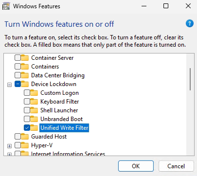

# Basic Shared Pc configuration in Intune (Part 2)

## Unified Write Filter (UWF)

    Unified Write Filter (UWF) is an optional Windows 10/11 feature that helps to protect your drives by intercepting and redirecting any writes to the drive (app installations, settings changes, saved data) to a virtual overlay. The virtual overlay is a temporary location that is cleared during a reboot or when a guest user logs off. (Taken from the Microsoft learn website).

    - Since the SharedPC policy doesn't quite offer this feature (not at all), this feature will be installed on a few machines to start a trial period. This trial period will allow the determination of the proper confirguration between Intune and UFW. 

    - Hypothese : With UWF installed on several machines, we will be able, supported by the logs of the machine, to established the proper configuration of UWF and Intune and determine if this combinaition as a good alternative to DeepFreeze.

# Plan :

## Installation of UWF on 3 machines

    - UFW is not automatically installed on Windows. It needs to be activated. Here's where in Windows 10 and 11 :
        

    - Make sure that before installing this feature, the OS is a much of out of the box as possible. Since this a trial, we do not want anything that can influence the tests.
        - The 3 machines have been resetted with OOBE