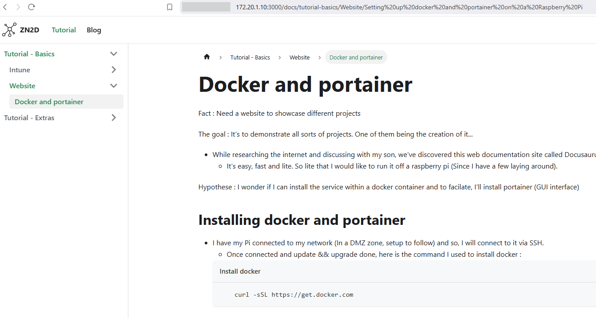

# Docker and portainer on a Raspberry Pi

Fact : Need a website to showcase different projects


The goal : It's to demonstrate all sorts of projects. One of them being the creation of it...
    - While researching the internet and discussing with my son, we've discovered this web documentation site called Docusaurus. 
        - It's easy, fast and lite. So lite that I would like to run it off a raspberry pi (Since I have a few laying around).

Hypothese : I wonder if I can install the service within a docker container and to facilate, I'll install portainer (GUI interface)

## Installing docker and portainer

    - I have my Pi connected to my network (In a DMZ zone, setup to follow) and so, I will connect to it via SSH. 
        - Once connected and update && upgrade done, here is the command I used to install docker :
        ```jsx title="Install docker"
            curl -sSL https://get.docker.com
        ```
        - Then I gave the current user the right to acces Docker :
        ```jsx title="User rights"
            sudo usermod -aG docker dan
        ```
        - And here the command to install Portainer, the linux arm cummunity edition(CE) :
        ```jsx title="Install Portainer"
            sudo docker pull portainer/portainer-ce:linux-arm
        ```
        - Once the pull completed, we need to create a container for Portainer :
        ```jsx title="Starting Portainer"
        sudo docker run -d -p 9000:9000 --name=portainer --restart=always -v /var/run/docker.sock:/var/run/docker.sock -v portainer_data:/data portainer/portainer-ce:linux-arm
        ```
            - OK, here's what I found about this command :
                - To run the container -(d)etached : Docker run -d
                - (p)ublish list of ports. In this case 9000:9000
                - You give it a -name
                - If the service stops, you want it to -restart
                - Bind mount a -(v)olume (Couldn't find all the WHYs for all of these)

## Portainer : docker image or docker compose?

    - Next, I reached portainer and tried a couple of things :

        I went to search images to see if they add something that I could use right away.
            
        
        I couldn't find an image that would work from the start... the goal is to create and host the website as soon as possible. So what I did :
            Installed all the necessary apps on the Raspberry Pi (Node.js and docker was already installed)
                Using this website : https://docusaurus.community/knowledge/deployment/docker/?target=caddy&package-managers=npm. I was able to create my own image.
                    **But it seems that I cannot get it to work, problems with react?**

        So what I decide to do instead is to run it with docker compose (instructions in the previous link). I took the serve approach on port 3000. 
        

        And it works!!

        

    	Next Step : Hosting the domain ZN2D.com from raspberry pi